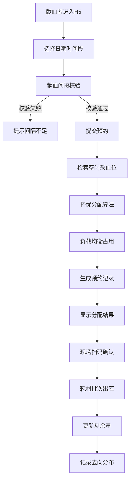

# 血站采血车排班系统 PRD

## 1. 产品概述
血站采血车排班H5系统是一套面向献血者和血站工作人员的智能排班管理系统。献血者可通过移动端选择采血时间预约献血，系统自动从空闲采血位中择优分配以避免碎片化；同时实现采血耗材的批次化管理，精确追踪每批耗材的剩余量和去向分布。

- 核心目标：提升采血效率、优化资源利用率、实现耗材精细化管理
- 目标用户：献血者、采血站管理人员、护士/采血员
- 核心价值：智能排班避免碎片时间、耗材全生命周期追溯、献血安全间隔校验

## 2. 核心功能

### 2.1 用户角色

| 角色 | 说明 | 核心权限 |
|------|------|----------|
| 献血者 | 通过H5页面预约的普通用户 | 选择采血时间、查看分配结果、查看献血记录 |
| 管理员 | 血站管理人员 | 采血位建档、排班管理、耗材批次管理、数据统计 |
| 采血员 | 现场采血护士 | 确认采血、耗材出库、查看分配结果 |

### 2.2 功能模块

1. **采血排期模块**：采血位资源建档、排班日历、时间段管理、献血预约
2. **自动分配模块**：空闲资源检索、择优分配算法、负载均衡、碎片时间优化
3. **耗材批次模块**：耗材入库、批次管理、批次拆分出库、耗材类型管理
4. **剩余追踪模块**：剩余量统计、去向分布记录、使用日志、预警提醒
5. **献血间隔校验**：基于身份信息校验上次献血时间、确保符合法定间隔

### 2.3 页面详情

| 页面名称 | 模块名称 | 功能描述 |
|----------|----------|----------|
| 首页仪表盘 | 数据概览 | 今日预约数、采血位状态、耗材库存预警、快捷操作入口 |
| 预约挂号页 | 采血排期 | 日历选择日期、时间段选择、确认预约、献血间隔校验 |
| 分配结果页 | 自动分配 | 显示分配的采血位编号、采血时间、注意事项、二维码 |
| 采血位管理页 | 采血排期 | 采血位建档、状态管理、排班设置、容量配置 |
| 排班日历页 | 采血排期 | 月/周视图排班表、预约详情、状态标记 |
| 耗材批次页 | 耗材批次 | 批次列表、入库登记、批次详情、拆分出库操作 |
| 剩余追踪页 | 剩余追踪 | 批次剩余量统计、去向分布图、使用时间轴、库存预警 |
| 献血记录页 | 献血间隔 | 历史献血记录、上次献血时间、间隔提醒 |

## 3. 核心流程

### 3.1 献血预约主流程
献血者进入预约页面 → 选择日期和时间段 → 系统校验献血间隔 → 通过后提交预约 → 系统从空闲采血位择优分配（负载均衡+避免碎片）→ 显示分配结果（采血位号+时间+二维码）→ 现场扫码确认 → 耗材批次出库 → 更新剩余量和去向记录

### 3.2 流程图示

### 3.3 耗材管理流程
耗材批次入库 → 录入批次信息（批号、数量、有效期）→ 拆分为多次出库 → 每次采血关联耗材 → 实时追踪剩余量 → 记录每次使用去向 → 低库存预警

## 4. 用户界面设计

### 4.1 设计风格
- **主色调**：医疗红（#E53935）作为主色，传达生命与关爱的品牌感；配合深青蓝（#00838F）作为辅助色，体现专业与信任
- **中性色**：白色背景为主，配合浅灰（#F5F7FA）卡片背景，深灰（#37474F）文字
- **按钮风格**：圆角12px的胶囊形按钮，主色填充+阴影，悬停时微上浮效果
- **字体**：使用"PingFang SC"、"Microsoft YaHei"等无衬线中文字体，标题字号18-20px，正文字号14px
- **布局风格**：卡片式布局，圆角16px，轻微阴影，模块分明，移动端优先
- **图标风格**：使用线性图标（Lucide Icons），统一2px线宽，医疗相关图标（心形、血滴、日历等）

### 4.2 页面设计概览

| 页面名称 | 模块名称 | UI元素 |
|----------|----------|--------|
| 首页仪表盘 | 数据概览 | 顶部状态栏、4宫格数据卡片、快捷操作区、底部Tab导航 |
| 预约挂号页 | 采血排期 | 周历滑动选择器、时间段网格卡片、预约表单、确认按钮 |
| 分配结果页 | 自动分配 | 大号采血位编号、时间信息卡、二维码展示区、注意事项列表 |
| 采血位管理页 | 采血排期 | 采血位卡片网格、状态标签（空闲/占用/维护）、建档表单 |
| 排班日历页 | 采血排期 | 月视图日历网格、色块标记状态、点击弹窗详情 |
| 耗材批次页 | 耗材批次 | 批次列表卡片、入库按钮、进度条显示剩余比例、拆分操作 |
| 剩余追踪页 | 剩余追踪 | 环形图剩余占比、时间轴使用记录、去向分布图、预警卡片 |
| 献血记录页 | 献血间隔 | 时间轴历史记录、间隔天数卡片、下次可献血日期提示 |

### 4.3 响应式设计
- 采用移动端优先（Mobile-First）设计策略
- 基础宽度：375px（iPhone SE），适配至428px（iPhone 14 Pro Max）
- 平板适配：768px以上调整为2列网格布局
- 触摸优化：所有可点击区域≥44×44px，间距≥8px
- 滑动交互：日历支持左右滑动切换周/月

### 4.4 动效与交互
- 页面切换：滑动过渡动画（200ms ease-out）
- 按钮点击：缩放反馈（scale: 0.97）+ 波纹效果
- 数据加载：骨架屏占位 + 渐入动画
- 分配结果：数字从0递增至目标值的动画效果
- 时间轴：滚动触发渐入显示
